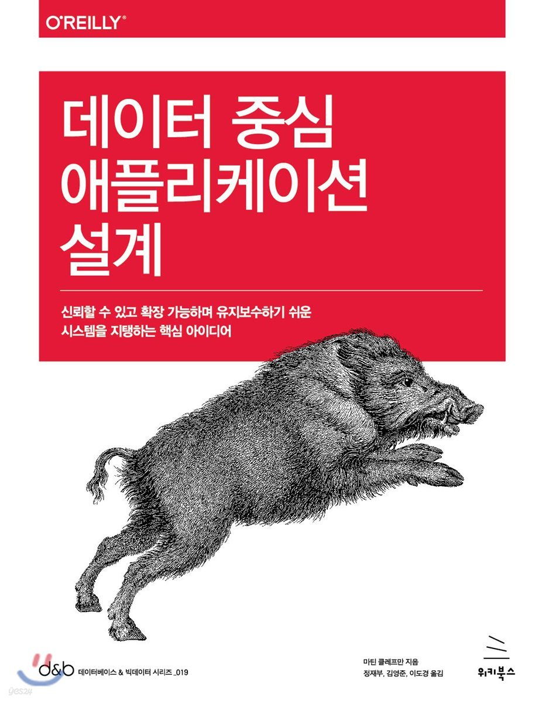

# designing-data-intensive-applications

## 데이터 중심 애플리케이션 설계 책 스터디

### 이번 스터디가 끝난 뒤 얻고 싶은 것

본 도서를 1회 완독, 데이터 저장/처리 관점에서 서비스 환경이 확장성, 성능, 신뢰성 등을 충족하기 위해 필요한 기술을 이해한다.

### 스터디 운영 방식

- 발표자료 작성
    - 노션 하단 캘린더에서 해당 스터디 일자에 개인별로 페이지를 생성하여 작성한다.
    - 학습하면서 어려웠거나 이해가 안 되는 점을 정리하여 추가한다. (스터디 때 팀원들과 논의할 수 있도록)
    - 주 목적은 학습이므로 문서 작성에 너무 많은 리소스를 들일 필요는 없다. (하지만 public하게 노출되는 만큼 퀄리티가 유지되면 좋다)

- 오프라인 모임
    - 스터디는 매주 일요일 오전 스터디 카페를 통해 진행한다.

- 발표 방식
    - 매주 모임 때 랜덤으로 1명을 지정하여 발표를 수행한다. (고로 발표 자료는 모두가 준비한다)
    - 흥미있거나 자신있는 챕터라면 스터디 당일 자원하여 발표할 수 있다. (권장)
    - 발표 시간에는 학습 중 모르거나 어려웠던 부분을 서로 질문하고 답변하는 시간을 갖는다.
        - 발표자라고 해서 꼭 잘 알지 못해도 된다.

### 지각과 벌금

- 벌금 규정
    - 지각 : 3,000 원
    - 불참 : 6,000 원
- 정시가 되더라도 1분 경과 전에 스터디 장소 입장하면 출석으로 인정한다.
- 벌금은 총무 담당자가 입금받아 관리하며 스터디 종료일에 커피나 간식비 등에 사용한다.

### 스터디원 역할

스터디원은 작더라도 하나의 역할이 있으면 조금 더 책임감을 가질 수 있기 때문에 좋다. 그렇기에 역할을 분배한다.

- 김동혁(스터디장, 출석/지각 체크)
- 김완주(발표자료 체크)
- 김건(github 레포지토리 관리)
- 김윤정(스터디 일지 작성 및 관리)
- 장진아(스터디 장소 예약 및 총무)
- 장민제(스터디 장소 예약 및 총무)

## 발표자료

[1주차, Ch01.데이터 시스템의 기초](Part%201.%20데이터%20시스템의%20기초/01.%20신뢰할%20수%20있고%20확장%20가능하며%20유지보수하기%20쉬운%20애플리케이션.md)